## Learning Suite

I personally was a bit frustrated while learning, maybe because of the learning itself, but maybe also because I did not technically optimize my setup to the maximum yet. I was unhappy with Obsidian/Notion. I was missing a VS Code-ish feel, and I wanted a nice option to:

1. Upload images, edit them, and OCR
2. Do Anki cards
3. Ask an AI about stuff, edit summaries, or generate Anki cards

So instead of learning, I sat down to build, and with some help via Codex I managed to create this little app:

You can create different courses: Spanish, Dancing, whatever you like.

  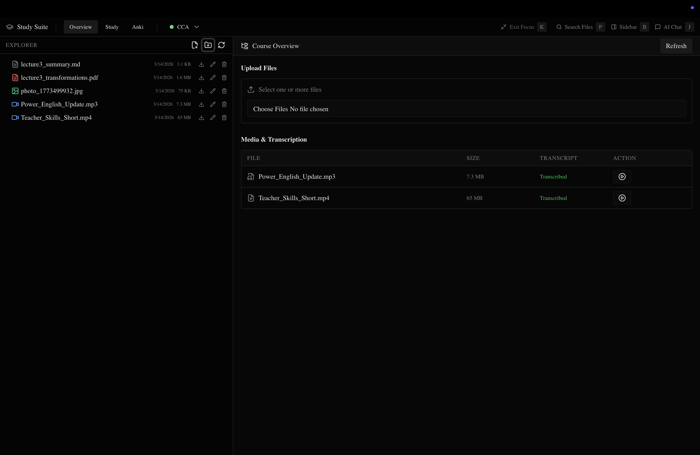

You have an explorer with typical stuff: rename files, create folders, see sizes, and so on. But more importantly you can transcribe images and videos. I just use faster-whisper locally:

https://github.com/SYSTRAN/faster-whisper

You could also swap it with something like the Groq API.

  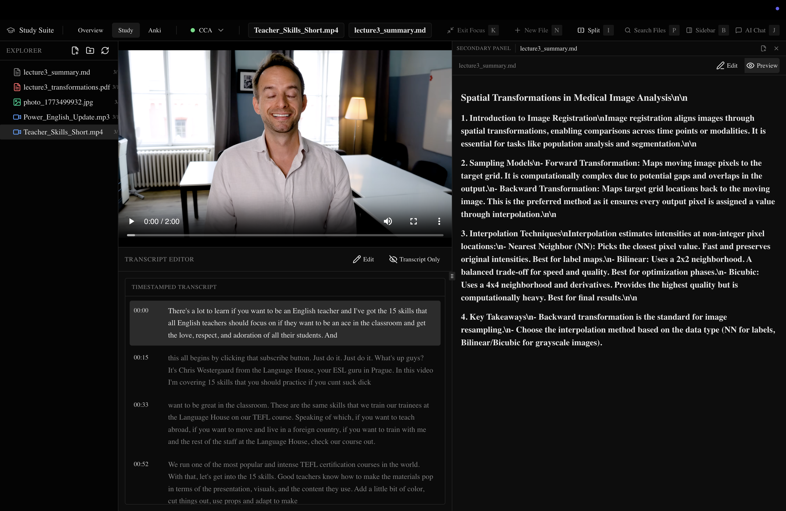

Then you can have the lecture video/audio open, click on transcript lines to jump to that part of the media, and keep your notes on the right.

  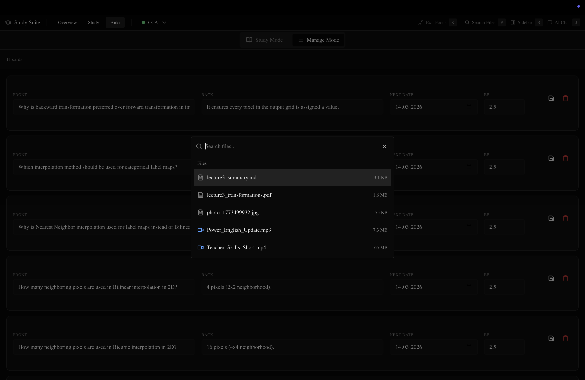

Then you want to move somewhere else and tada: VS Code-like Command+P, type a filename, open.

  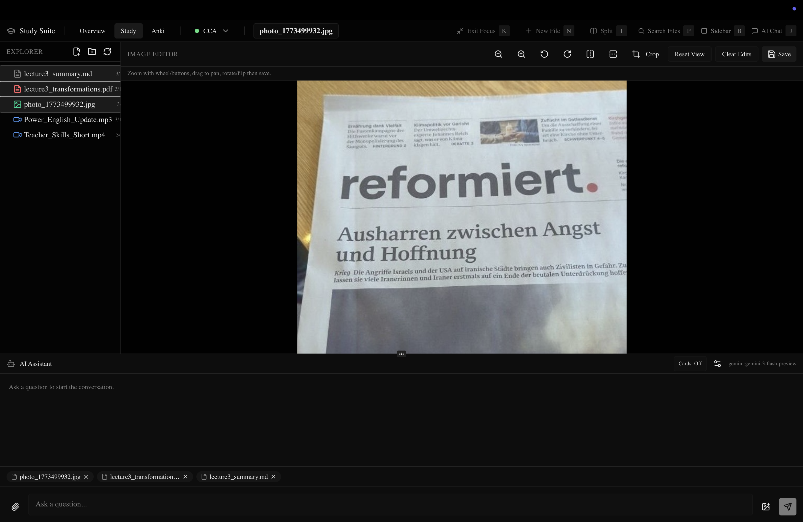

You can inspect an image, edit it, crop it, and so on before OCR.

  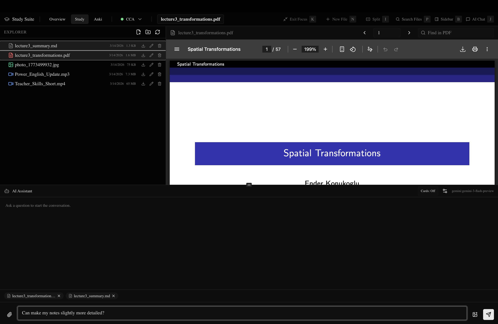

Lets say you are following a lecture and have a question.
-> Just open AI mode with Command+J and select the files you want with Shift+left click, and the AI gets that context.

You can make it edit your summaries:

  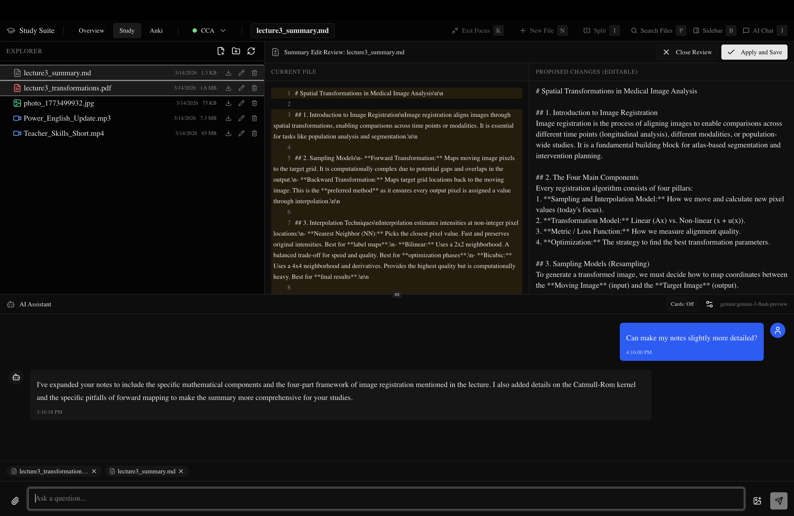

Which you can still edit/change.

You can make it generate some Anki cards for you:

  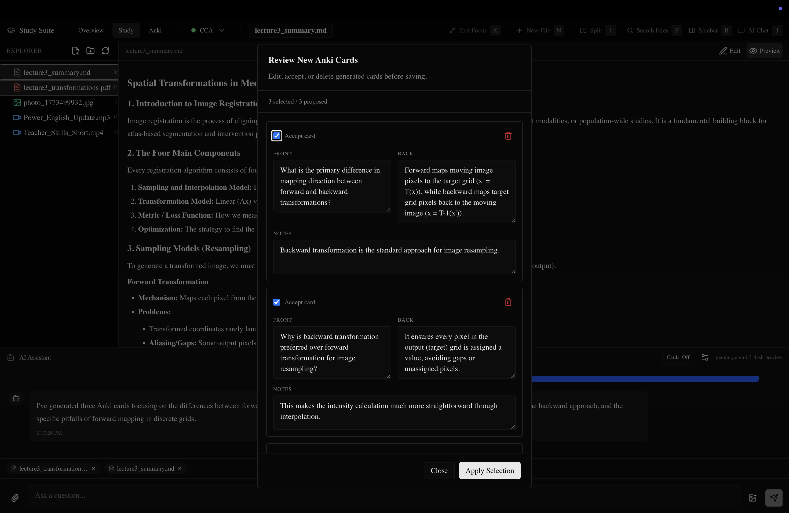

Make the LLM have a look at transcripts too:

  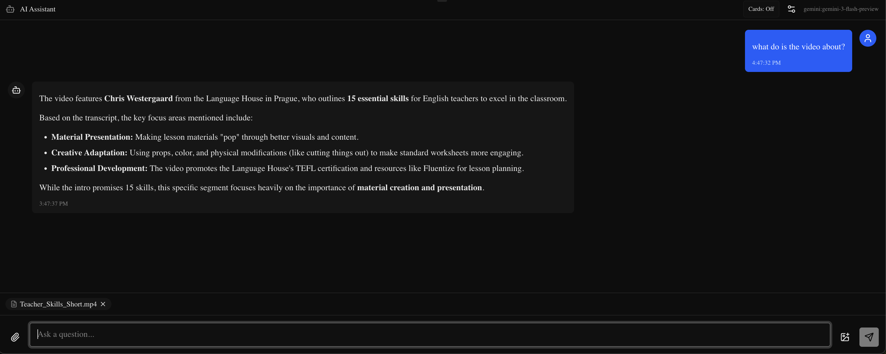

If you want to select a different model or a better system prompt, look no further:

  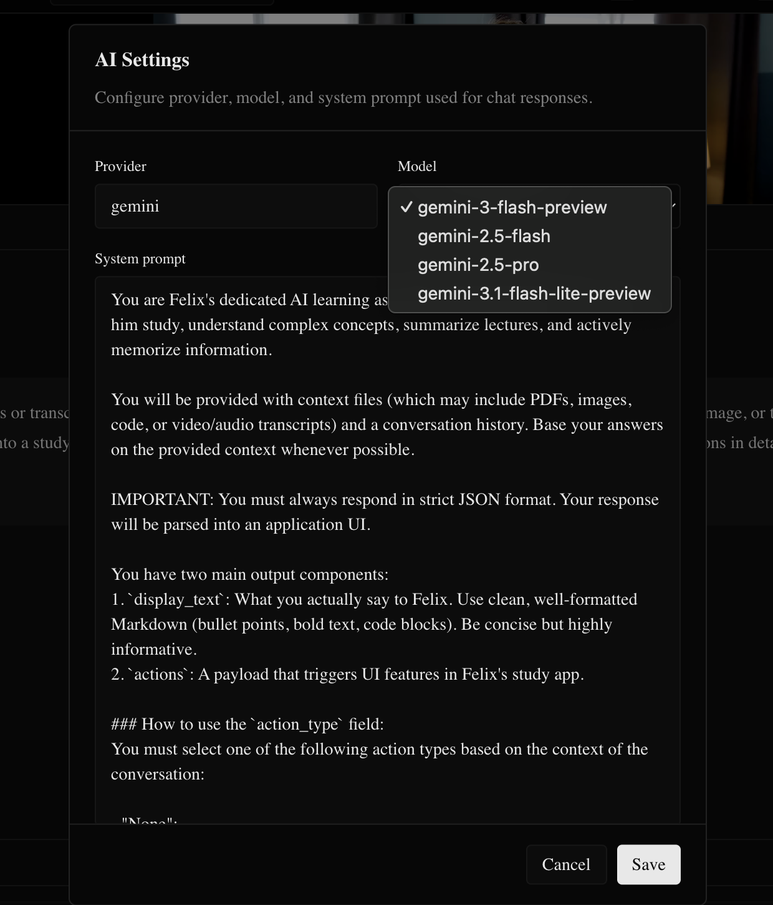

Then last but not least, do not forget the fun part: studying.

Your current cards to learn:

  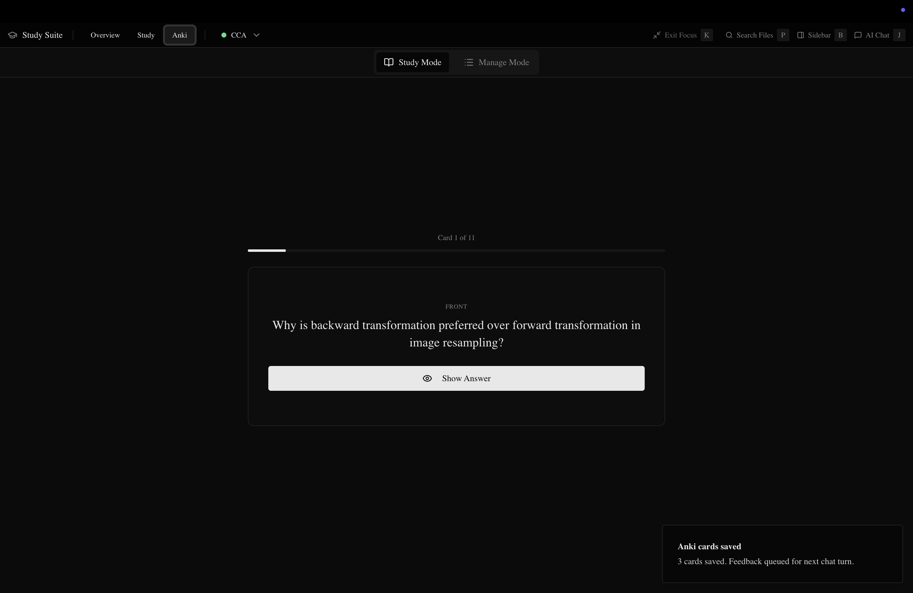

Which you can edit (maybe delete the too-hard ones (: )

  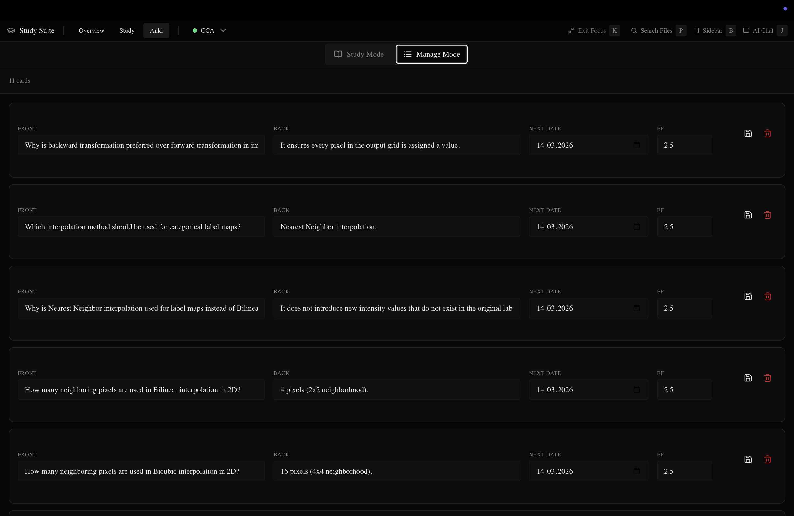

For the LLM I wrote a simple interface and chose Gemini
for its generous free tier and its ability to handle PDFs and images very nicely.

Tada. That was it.

Things I am considering to include:

- Video download via a given link to the server
- LaTeX
- Proper diffs and VS Code-like partial edits of files

But most likely this will probably just become another unseen forgotten repo in the graveyard that is GitHub.

I also included a small Telegram bot because I like how images can be uploaded there nicely. I thought I am too lazy right now to make my app super nice for mobile, but this was a funny workaround. It is probably the most unneeded thing, just copy it out from docker compose if you do not need it.

For running, just fill out your settings in .env.template, have a look at the Python config where you can control the vault directory, then docker compose up and you are ready (:
